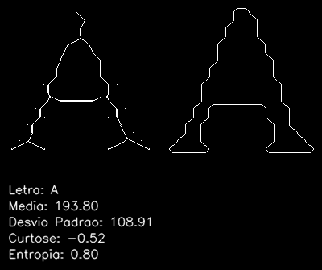
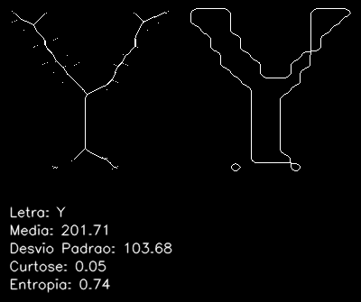

## OpenCV Feature Extraction

Projeto para análise de letras do alfabeto por meio da combinação de Python e OpenCV, juntamente com a biblioteca GLCM (Gray-Level Co-occurrence Matrix). O projeto é dividido em duas etapas, a primeira sendo focada na extração de características e na geração de estatísticas descritivas das letras, enquanto a segunda está focada na geração de imagens com filtro de textura e obtenção dos valores das matrizes de co-ocorrência das texturas.

Na primeira etapa (extração de características), foram implementadas técnicas de processamento de imagem com OpenCV para analisar 25 imagens diferentes para cada letra do alfabeto. Foram geradas duas características estruturais: o esqueleto das letras e o contorno delas. Além das características estruturais, foram calculadas quatro características estatísticas para cada letra: média, desvio padrão, curtose e entropia. Essas medidas fornecem informações detalhadas sobre as propriedades das letras.

Na segunda etapa do projeto (extração de textura), a ênfase foi na extração de informações texturais das letras. Foram aplicados filtros em 10 imagens diferentes para cada letra do alfabeto, e foram geradas cinco matrizes de co-ocorrência de níveis de cinza (GLCMs) para cada imagem. As GLCMs representam a relação entre os valores de intensidade dos pixels em uma imagem, capturando texturas e padrões. Às cinco características extraídas de cada GLCM foram: dissimilaridade, homogeneidade, contraste, energia e ASM. Além disso, para as mesmas matrizes de co-ocorrência, foram obtidos os valores de texturas identificados e classes.

Para os filtros do GLCM, foi utilizado o código de fast_glcm criado por [Taka Tzm](https://github.com/tzm030329/GLCM/), enquanto para a geração dos valores das matrizes de co-ocorrência para cada um dos valores escolhidos, foi utilizado o scikit-image.

## Sobre o trabalho:

* Disciplina: OP63I-CC8 - Processamento De Imagens E Reconhecimento De Padrões	
* Turma: 2023/2 - 8º Período
* Docente: Prof. Dr. Pedro Luiz de Paula Filho

## Recursos 
- **Extração de Características Estruturais:** Foram extraidos duas características estruturais: esqueleto e contorno.
- **Extração de Características Estatítiscas:** Foram extraidos quatro características estatísticas: média, desvio-padrão, curtose e entropia.
- **Aplicação de Filtros GLCM:** Imagens convertidas com filtros GLCM, a partir do fast_GLCM com cinco matrizes de co-ocorrência de níveis de cinza: dissimilaridade, homogeneidade, contraste, energia e ASM.
- **Obtenção dos valores de GLCM com SkImage:** Valores das matrizes de co-ocorrência obtidos através do SkImage para as matrizes de: dissimilaridade, homogeneidade, contraste, energia e ASM

## Dependências
**Dependêndicas utilizadas:** Python 3, NumPy, OpenCV (cv2), Matplotlib e SkImage.

### Para o Linux:  
`pip install python3 numpy opencv-python matplotlib scikit-image` 

### Para o Windows:
1. Python 3.11.5 ([Instalador 64-bit](https://www.python.org/downloads/windows/))
2. `pip install numpy opencv-python matplotlib scikit-image` 

## Como Utilizar
1. Clone o repositório do GitHub: `git clone https://github.com/thiagodalsanto/feature_extraction.git`
2. Instale as [dependências](#dependências) utilizadas
3. Execute o aplicativo em uma IDE, dentro da raiz do projeto, com o comando:
   1. Linux: `python3 main.py`
   2. Windows: `python main.py`

## Imagens da Aplicação

Imagem 1 - Na esquerda o esqueleto gerado para a letra, a direita o contorno dela. Abaixo da imagem os dados estatísticos da imagem original. Ao todo foram gerados para 25 formatos diferentes para cada letra do alfabeto.

    
    

Imagem 2 - Valores númericamente identificados para características estruturais (média do esqueleto e área do contorno), características restatísticas (média, desvio padrão, curtose e entropia) e características de texturas, para valores das matrizes de co-ocorrência para dissimilaridade, homogeneidade, contraste, ASM e energia, salvos para 100 imagens diferentes da mesma letra, para cada letra do alfabeto, totalizando 2400 imagens análisadas.

Ordem de leitura separada por espaços: Dissimilaridade, Homogeneidade, Contraste, ASM, Energia, Média, Desvio padrão, Curtose, Entropia, Classe.

    

Imagem 3 - Aplicação de filtros do fast_GLCM gerados para cada letra do alfabeto. Ao todo foram gerados para 10 formatos diferentes para cada letra do alfabeto. Foram gerados para dissimilaridade, homogeneidade, contraste, energia e ASM.

    

