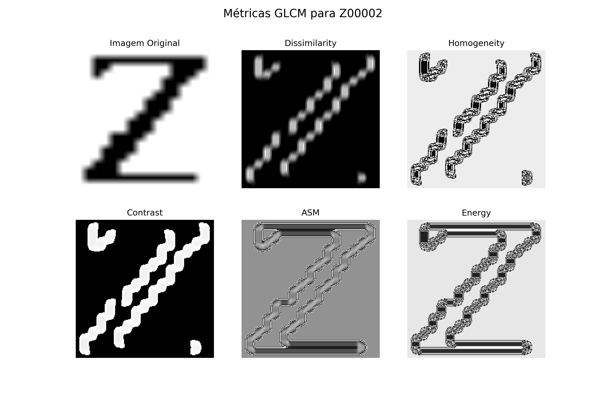

## OpenCV Feature Extraction

Este repositório contém um conjunto de scripts e recursos para a análise de letras do alfabeto por meio da combinação de Python e OpenCV, juntamente com a biblioteca GLCM (Gray-Level Co-occurrence Matrix). O projeto é dividido em duas etapas, cada uma focada na extração de características e na geração de estatísticas descritivas das letras.

Na primeira etapa (Extração de Características), foram implementadas técnicas de processamento de imagem com OpenCV para analisar 25 imagens para cada letra do alfabeto. Foram geradas duas características estruturais: o esqueleto das letras e o contorno delas.

Além das características estruturais, foram calculadas quatro características estatísticas para cada letra: Média, Desvio Padrão, Curtose e Entropia. Essas medidas fornecem informações detalhadas sobre as propriedades das letras.

Na segunda etapa do projeto (Análise de Textura), a ênfase foi na extração de informações texturais das letras. Foram analisadas 10 imagens para cada letra do alfabeto, e foram geradas cinco Matrizes de Coocorrência de Níveis de Cinza (GLCMs) para cada imagem. As GLCMs representam a relação entre os valores de intensidade dos pixels em uma imagem, capturando texturas e padrões.

As cinco características extraídas de cada GLCM foram: Dissimilaridade, Homogeneidade, Contraste, Energia e ASM. Essas características texturais fornecem insights valiosos sobre a variação da textura das letras.

Para o GLCM, foi utilizado o código de fast_glcm criado por [Taka Tzm](https://github.com/tzm030329/GLCM/).

## Sobre o trabalho:

* Disciplina: OP63I-CC8 - Processamento De Imagens E Reconhecimento De Padrões	
* Turma: 2023/2 - 8º Período
* Docente: Pedro Luiz de Paula Filho

## Recursos 
- **Extração de Características Estruturais:** Foram extraidos duas características estruturais: Esqueleto e Contorno.
- **Extração de Características Estatítiscas:** Foram extraidos quatro características estatísticas: Média, Desvio-padrão, Curtose e Entropia.
- **Análise de Texturas:** Foi convertido utilizando o GLCM, cinco matrizes de coocorrência de níveis de cinza: Homogeneidade, Contraste, Energia e ASM.

## Dependências
Siga essa ordem de instalação para ambos os sistemas operacionais, para garantir que não exista conflito de versões:

### Para o Linux:
1. Python 3 `pip install python3`
2. NumPy `pip install numpy`
3. OpenCV (cv2) `pip install opencv-python`
4. Matplotlib `pip install matplotlib`
5. Skimage `pip install skimage`

### Para o Windows:
1. Python 3.11.5 ([Instalador 64-bit](https://www.python.org/downloads/windows/))
2. NumPy `pip install numpy`
3. OpenCV (cv2) `pip install opencv-python`
4. Matplotlib `pip install matplotlib`
5. Skimage `pip install skimage`
## Como Utilizar

1. Clone o repositório do GitHub: `git clone https://github.com/thiagodalsanto/feature_extraction.git`
2. Instale as [dependências](#dependências) utilizadas
3. Execute a etapa 4 para o arquivo `main.py` dentro da raiz do projeto
4. Execute o aplicativo em uma IDE com o comando => para Linux: `python3 main.py` e para Windows: `python main.py`

## Imagens da Aplicação

Imagem 1 - Na esquerda o esqueleto de uma das imagens da letra, a direita o contorno dela. Abaixo da imagem os dados estatísticos da imagem original. Ao todo foram gerados para 25 formatos de letra diferente para cada letra do alfabeto.

    
    

Imagem 2 - Métricas do GLCM gerados para cada letra do alfabeto. Ao todo foram gerados para 10 formatos de letra diferente para cada letra do alfabeto. Foram gerados para Dissimilaridade, Homogeneidade, Contraste, Energia e ASM.

    

